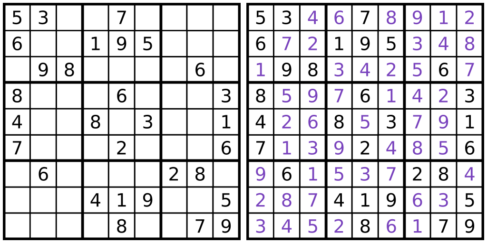

# A simple Sudoku created overnight with PHP.

## Features
- Generate random initial scheme
- Select difficulty (Easy, Medium, Hard, Expert)
- Ability to resolve the scheme by entering input with instant feedback in case the privided number is wrong
- Ability to provide a solution for a give initial scheme
- UI generated with aider

## Demo
Feel free to try it out at the following [link](https://ironhackable.com/sudoku/){:target="_blank"}
